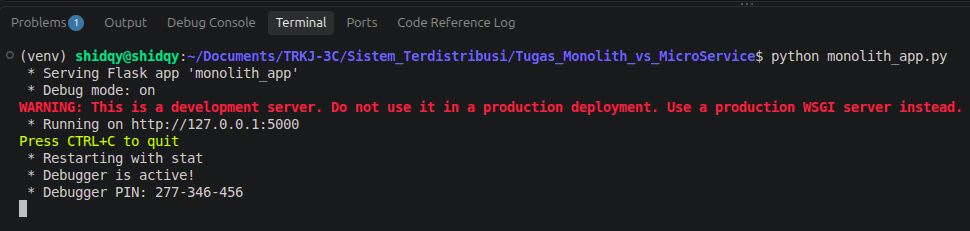
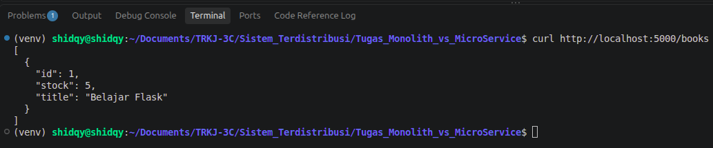
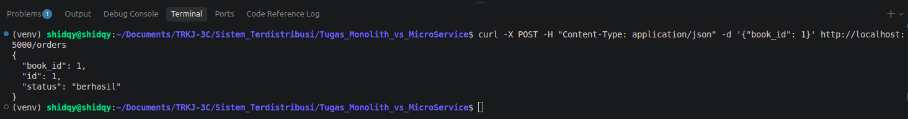
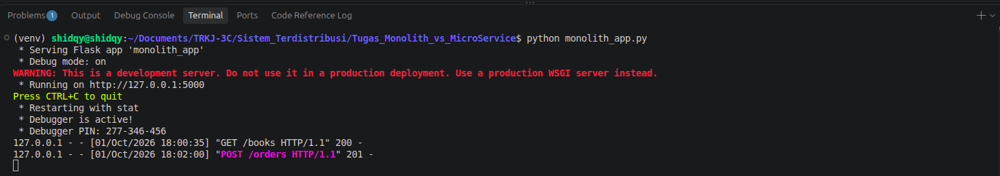
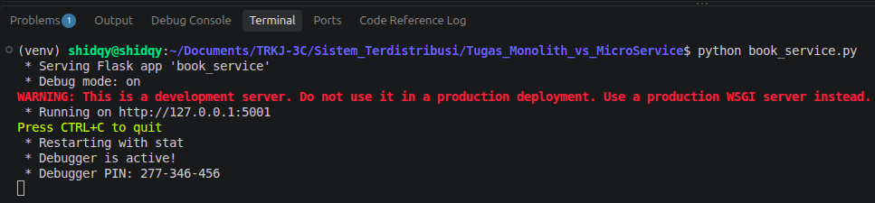
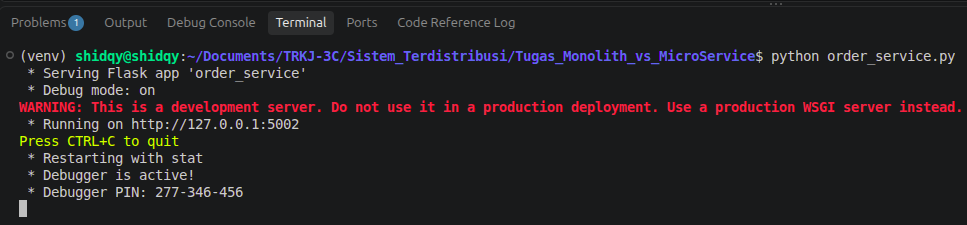
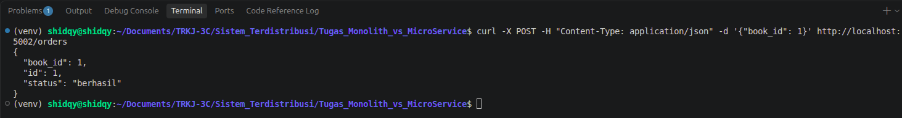
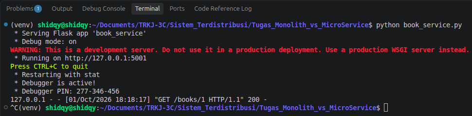
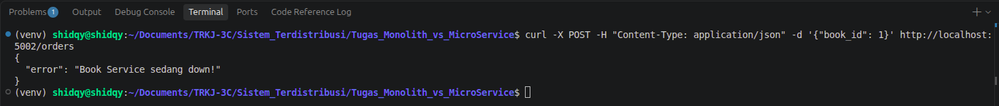

# Hands-on: Arsitektur Monolith vs Microservices dengan Flask Python

Repository ini berisi implementasi perbandingan arsitektur Monolith dan Microservices menggunakan Flask (Python) pada OS Linux Ubuntu.

## Struktur File
* `monolith_app.py`: Seluruh fitur (Book & Order) disatukan dalam port 5000.
```bash
from flask import Flask, jsonify, request

app = Flask(__name__)

# Database in-memory
books = [{"id": 1, "title": "Belajar Flask", "stock": 5}]
orders = []

# FITUR BUKU
@app.route('/books', methods=['GET'])
def get_books():
    return jsonify(books)

# FITUR PESANAN
@app.route('/orders', methods=['POST'])
def create_order():
    data = request.get_json()
    book_id = data.get('book_id')

    # Logika bisnis: Cek stok buku langsung dari variabel global
    for b in books:
        if b['id'] == book_id and b['stock'] > 0:
            b['stock'] -= 1
            order = {"id": len(orders) + 1, "book_id": book_id, "status": "berhasil"}
            orders.append(order)
            return jsonify(order), 201

    return jsonify({"error": "Buku tidak ditemukan atau stok habis"}), 400

if __name__ == '__main__':
    # Aplikasi berjalan di port 5000
    app.run(port=5000, debug=True)
```

* `book_service.py`: Microservice khusus mengelola data buku pada port 5001.
```bash
from flask import Flask, jsonify

app = Flask(__name__)

# Database khusus Book Service
books = [{"id": 1, "title": "Belajar Flask", "stock": 5}]

@app.route('/books', methods=['GET'])
def get_books():
    return jsonify(books)

@app.route('/books/<int:book_id>', methods=['GET'])
def get_book(book_id):
    for b in books:
        if b['id'] == book_id:
            return jsonify(b)
    return jsonify({"error": "Not found"}), 404

if __name__ == '__main__':
    # Book service berjalan di port 5001
    app.run(port=5001, debug=True)
```

* `order_service.py`: Microservice khusus mengelola order pada port 5002 yang berkomunikasi dengan Book Service via HTTP.
```bash
from flask import Flask, jsonify, request
import requests

app = Flask(__name__)
orders = []
BOOK_SERVICE_URL = "http://localhost:5001" # Alamat Book Service

@app.route('/orders', methods=['POST'])
def create_order():
    data = request.get_json()
    book_id = data.get('book_id')

    # Komunikasi antar service: Tanya Book Service apakah buku ada
    try:
        response = requests.get(f"{BOOK_SERVICE_URL}/books/{book_id}")
        if response.status_code == 200:
            book_data = response.json()
            if book_data['stock'] > 0:
                order = {"id": len(orders) + 1, "book_id": book_id, "status": "berhasil"}
                orders.append(order)
                return jsonify(order), 201
            return jsonify({"error": "Buku tidak tersedia"}), 400
    except requests.exceptions.ConnectionError:
        return jsonify({"error": "Book Service sedang down!"}), 500

if __name__ == '__main__':
    # Order service berjalan di port 5002
    app.run(port=5002, debug=True)
```

## Panduan Pengujian

### 1. Menguji Monolith App
1. Buka terminal dan jalankan:
```bash
python monolith_app.py
```


2. Buka terminal satunya lagi untuk cek buku:
```bash
curl http://localhost:5000/books
```


3. Buat pesanan:
```bash
curl -X POST -H "Content-Type: application/json" -d '{"book_id": 1}' http://localhost:5000/orders
```


4. Hasil dari pemesanan berhasil di respon oleh server di port 5000:



### 2. Menguji MicroService App
1. Buka 3 terminal terpisah:

Terminal 1: python book_service.py (Port 5001)



Terminal 2: python order_service.py (Port 5002)



Terminal 3 (Uji Coba):

```bash
curl -X POST -H "Content-Type: application/json" -d '{"book_id": 1}' http://localhost:5002/orders
```


### 3. Eksperimen Fault Isolation
1. Matikan book_service.py di Terminal 1 (Ctrl + C).



2. Kirim ulang pesanan dari Terminal 3.



order_service.py akan merespons pesan error: {"error": "Book Service sedang down!"} dengan HTTP status 500.